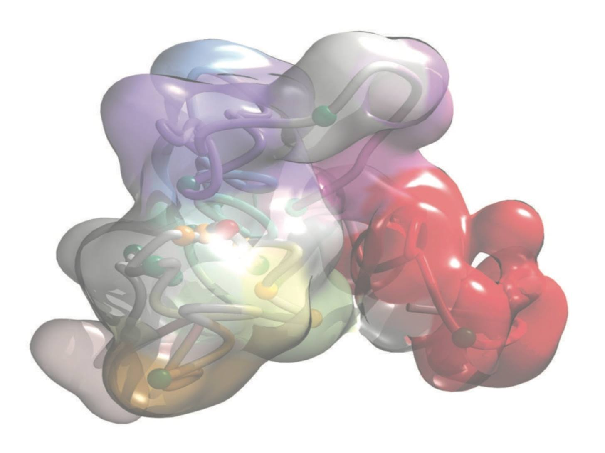

## Course Description

3C-based methods, such as Hi-C, produce a huge amount of raw data as pairs of DNA reads that are spatially close in the cell nucleus. Overall, these interaction matrices have been used to study how the genome folds within the nucleus, that is one of the most fascinating problems in modern biology. The rigorous analysis of the paired-reads using computational tools has been essential to fully exploit the experimental technique, and to study how the genome is folded in the space. Currently, there is a huge expansion on the wealth of data on genome structure with the availability of many datasets of Hi-C experiments down to 1 kb resolution (see for example: [Hi-C Data Browser](http://hic.umassmed.edu/welcome/welcome.php); [3D Genome Browser](http://promoter.bx.psu.edu/hi-c/view.php) or [Aiden Lab](http://www.aidenlab.org/data.html)). 

## Target Audience

The course is designed for experimental researchers and bioinformaticians at the graduate and post-graduate levels which are interested in studying the genome spatial organization. 

It is likely that the participants to this course aim at getting involved in generating Hi-C data for  chromosome structure determination, or that they just want to be able to correctly interpret and analyse publicly available data.

## Detailed Program
 
<table>
  <tbody>
    <tr>
      <th>Days</th>
      <th>Lectures (pdf)</th>
      <th>Core pipeline (notebooks)</th>
      <th>Annex (notebooks)</th>
    </tr>
    <tr style="background-color:#e5e8eb">
     <td><strong>Day 1</strong></td>
     <td>
       <ul>
        <li> <a href="./assets/material/Presentations/Day1/01_20180917_Welcome.pdf">Welcome</a></li>
        <li> <a href="./assets/material//Presentations/Day1/02_20180917_introduction_to_structure_determination.pdf">Intro structure determination</a></li>
        <li> <a href="./assets/material/Presentations/Day1/03_20180917_3D-genomes_overview.pdf">3D Genomes overview</a></li>
        <li> <a href="./assets/material/Presentations/Day1/04_20180917_Intro_TADbit.pdf">Intro TADbit</a></li>
        <li> <a href="./assets/material/Presentations/Day1/05_20180917_NGS_for_HiC.pdf">NGS for HiC</a></li>
        <li> <a href="./assets/material/Presentations/Day1/06_20180917_linux.pdf">Intro UNIX</a></li>
        <li> <a href="./assets/material/Presentations/Day1/07_20180917_python.pdf">Intro Python</a></li>
       </ul>
     </td>
     <td>
       <ul>
        <li> <a href="./assets/material/Notebooks/00-Hi-C%20quality%20check.ipynb">Hi-C Quality check</a></li>
        <li> <a href="./assets/material/Notebooks/01-Mapping.ipynb">Mapping</a></li>
        <li> <a href="./assets/material/Notebooks/02-Parsing%20mapped%20reads.ipynb">Parsing mapped reads</a></li>
       </ul>
    </td>
    <td>
       <ul>
        <li> <a href="./assets/material/Notebooks/A0-Preparing%20your%20computer%20for%20HiC%20data%20analysis.ipynb">Software installation</a></li>
        <li> <a href="./assets/material/Notebooks/A1-Preparation%20reference%20genome.ipynb">Prepare reference genome</a></li>
        <li> <a href="./assets/material/Notebooks/A2-Download%20published%20Hi-C%20experiments.ipynb">Download Hi-C experiment</a></li>
       </ul>
    </td>
   </tr>
    <tr>
     <td><strong>Day 2</strong></td>
     <td>
       <ul>
        <li> <a href="./assets/material/Presentations/Day2/01_20180918_Summary_of_day_1.pdf">Morning wrap up</a></li>
        <li> <a href="./assets/material/Presentations/Day2/02_20180918_Chromatin_and_3Cs.pdf">Chromatin and 3Cs</a></li>
        <li> <a href="./assets/material/Presentations/Day2/03_20180918_TADbit.pdf">TADbit</a></li>
        <li> <a href="./assets/material/Presentations/Day2/04_20180918_Applications(II)_Caulobacter.pdf">Applications (I): Caulobacter</a></li>
       </ul>
     </td>
     <td>
       <ul>
        <li> <a href="./assets/material/Notebooks/03-Filtering%20mapped%20reads.ipynb">Filterind reads</a></li>
        <li> <a href="./assets/material/Notebooks/04-Bin-filtering%20and%20normalization.ipynb">Normalization</a></li>
       </ul>
    </td>
    <td>
       <ul>
        <li> <a href="./assets/material/Notebooks/A3-Compare%20and%20merge%20Hi-C%20experiments.ipynb">Compare/merge experiments</a></li>
       </ul>
    </td>
   </tr>
   <tr style="background-color:#e5e8eb">
     <td><strong>Day 3</strong></td>
     <td>
       <ul>
        <li> <a href="./assets/material/Presentations/Day3/01_20180919_Summary_of_day_2.pdf">Morning wrap up</a></li>
        <li> <a href="./assets/material/Presentations/Day3/02_20180919_Applications(II)_TAD_hormone.pdf">Applications(II) TAD hormone</a></li>
        <li> <a href="./assets/material/Presentations/Day3/02_20180920_Applications(IIIa)_SOX2Dynamics.pdf">Applications (III) SOX2 Dynamics</a></li>
       </ul>
     </td>
     <td>
       <ul>
        <li> <a href="./assets/material/Notebooks/05-Compartments%20and%20TADs.ipynb">Compartments and TADs</a></li>
       </ul>
    </td>
    <td>
       <ul>
        <li> <a href="./assets/material/Notebooks/A4-Align%20and%20compare%20TADs.ipynb">Align and compare TADs</a></li>
       </ul>
    </td>
   </tr>
   <tr>
     <td><strong>Day 4</strong></td>
     <td> 
      <ul>
        <li> <a href="./assets/material/Presentations/Day4/01_20180920_Summary_of_day_3.pdf">Morning wrap up</a></li>
        <li> <a href="./assets/material/Presentations/Day4/03_20180920_Applications(IIIb)_IMGR.pdf">Applications(IV): Super-resolution Imaging and modeling</a></li>
       </ul>
     </td>
     <td>
       <ul>
        <li> <a href="./assets/material/Notebooks/06a-Modeling%20-%20parameter%20optimization.ipynb">Parameter optimization</a></li>
        <li> <a href="./assets/material/Notebooks/06b-Modeling%20-%20model%20optimization.ipynb">Model optimization</a></li>
       </ul>
    </td>
    <td>
       <ul>
        <li> <a href="./assets/material/Notebooks/A5-Modeling%20-%20analysis%20of%203D%20models.ipynb">Analysis of 3D models</a></li>
       </ul>
    </td>
   </tr>
    <tr style="background-color:#e5e8eb">
     <td><strong>Day 5</strong></td>
     <td> 
      <ul>
        <li> <a href="./assets/material/Presentations/Day5/01_20180921_Summary_of_day_4.pdf">Morning wrap up</a></li>
        <li> <a href="./assets/material/Presentations/Day5/02_20180921_MuG.pdf">Multiscale Genomics</a></li>
        <li> <a href="./assets/material/Presentations/Day5/NucDyn_3DAROC18.pdf">Nucleosome dynamics</a></li>
        <li> <a href="./assets/material/Presentations/Day5/3DAROC_mcdna_chromdyn_juergenwalther_21_09_18.pdf">MC-DNA and Chromatin Dynamics</a></li>
       </ul>
     </td>
     <td></td>
     <td></td>
   </tr>
  </tbody>
</table>

---

### [Learning objetives and Pre-requisites](pages/prerequesites.md)

### [Instructors](pages/instructors.md)
---

The source for this course webpage is [on github](https://github.com/GTPB/Web_course_template).
